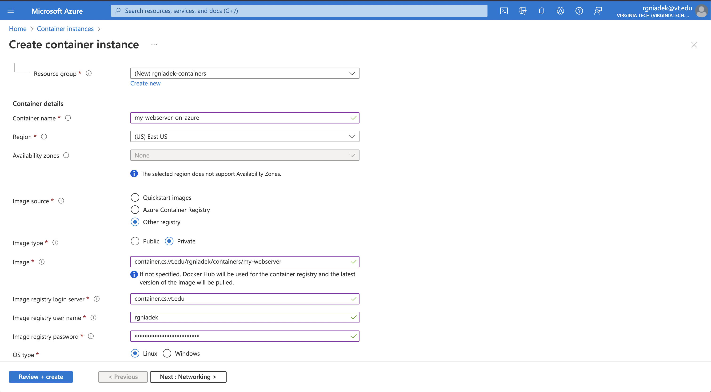

# Getting Started with Containers
***developed for CS 2104 by [Ryan Gniadek](https://ryangniadek.com) and Professor [Margaret Ellis](https://people.cs.vt.edu/maellis1/)***

## Assignment Setup

It is recommended you complete this assignment on rlogin

```
$ ssh <pid>@rlogin.cs.vt.edu
```

You will then want to clone this git repo on rlogin
```
$ git clone https://git.cs.vt.edu/<pid>/containers.git
```
and then change your current working directory to the repo
```
$ cd containers
```

## Introduction
The goal of this exercise is for students to learn:
- What is a container, and how it's different from deploying natively or on a virtual machine
- How to run a container image from a public registry
- How to build your own container image from a Dockerfile and then run that image
- How to deploy a container image to a registry
- How to run a container image on a cloud compute instance

For the purpose of this assignment, we will build a static website and serve the files using NGINX

## What is a container
If you do not have experience with Docker or containers, you are encouraged to [read this blog post](https://www.docker.com/resources/what-container/) from Docker. TL;DR containers are an environment-agnostic way to package up code, configuration, and dependencies and run it anywhere a container engine (most commonly Docker) is installed.

Both containers and virtual machines are ways of providing resource isolation and are widespread in modern application deployments. Virtual machines abstract away the hardware and emulate the entire operating system. On the other hand, containers use the underlying operating system of the host to execute, so they are much lighter weight since they only need to include the code and dependencies for a specific application.

## How to run a container image
[Docker Hub](https://hub.docker.com) is the most widely used public registry for container images. For commonly used applications like Ubuntu, node.js, or nginx a pre-built image can be quickly pulled from a registry rather than the user having to build that container themselves.

Let's practice running a container

```
$ docker run hello-world
```

> You may have noticed that the `hello-world` image on rlogin is actually aliased to pull from `quay.io/podman` instead of the Docker Hub registry. This is because rlogin actually uses an alternative container engine called podman. Understanding the implementation differences is beyond the scope of this assignment.

This `hello world` container is not very interesting. Let's try running nginx, which is a popular web server. After all, the end result of this exercise will be to serve our own website.

Before doing this, we must choose a unique port number to expose your running container. This is because you cannot have two processes running on the same port, and the entire class shares the rlogin machines.

Calculate your port number using the formula `6 * <LAST 4 DIGITS OF STUDENT ID>`. For example, if my student ID ended in `5432` I would choose port `32592` as my port. Use this port for the remainder of the assignment.
```
$ docker run --rm -d -p <YOUR PORT>:80 --name web nginx
```

When pulling the nginx web server image, it'll likely ask you which registry you want to pull from. It is recommended to use `docker.io` for this assignment. 

```
? Please select an image:
    registry.access.redhat.com/nginx:latest
    registry.redhat.io/nginx:latest
  ▸ docker.io/library/nginx:latest
```

Let's explain what all of the different options on the `docker run` command are doing:
- `--rm` this automatically removes the container and its file system after stopping the container
- `-d' detached mode, this runs the container as a background process
- `-p` expose a port on the container to the host machine given the argument `hostPort:containerPort`. So in the above command, we are exposing port `80` inside the container on port `<YOUR_PORT>` on the host machine
- `--name` assign a name to your running container, in our case, `web`. If no name is assigned, a random string is generated
- `nginx` is the name of the container image to run. If the container image is not on your machine already, it is automatically pulled from a registry.

Use `curl` to verify that nginx is running.

```
$ curl localhost:<YOUR_PORT>
```

You should receive the HTML for the nginx welcome page, which looks something like this. We could view this web page in a browser, except we are on rlogin, a terminal-only machine.

```html
<!DOCTYPE html>
<html>
<head>
<title>Welcome to nginx!</title>
<style>
html { color-scheme: light dark; }
body { width: 35em; margin: 0 auto;
font-family: Tahoma, Verdana, Arial, sans-serif; }
</style>
</head>
<body>
<h1>Welcome to nginx!</h1>
<p>If you see this page, the nginx web server is successfully installed and
working. Further configuration is required.</p>

<p>For online documentation and support please refer to
<a href="http://nginx.org/">nginx.org</a>.<br/>
Commercial support is available at
<a href="http://nginx.com/">nginx.com</a>.</p>

<p><em>Thank you for using nginx.</em></p>
</body>
</html>
```

Stop the container.

```
$ docker stop web
```

## Building Our Own Container Image
By default, NGINX will serve whatever files are located in `/usr/share/nginx/html` as your website. We are going to build a custom container image to bundle our web server with our static website files.

The way you define what goes in a container image is by using a Dockerfile. We have provided the following Dockerfile for you. It uses the latest version of the nginx webserver and copies your local site-content directory files to the docker directory that gets used for website content. 

```Dockerfile
FROM nginx:latest
COPY site-content /usr/share/nginx/html
```

This `Dockerfile` is using `nginx:latest` as the base image and then copies our `site-content` files on top of that.  Remember you can view the contents of the Dockerfile if you'd like.

```
$ cat Dockerfile
```

Before building this container image, we need to populate our `site-content` directory with our static website and make sure the directory has the proper permissions where it can be copied over.

- Edit the `site-content/index.html` file to use your pid (later you can explore hosting more involved websites)
- Use `chmod` to ensure the directory has proper permissions
```
$ chmod -R 744 site-content/
```

Now, let's build our image and name it `my-webserver`
```
$ docker build -t my-webserver .
```
> Do not forget the `.` at the end. This specifies the build context as the current directory. Understanding what build context means is beyond the scope of this assignment, in the vast majority of cases, it will be the current directory.

> The `-t` option is how you specify a name, aka tag, for your image. In this case `my-webserver`

You can use the `docker images` command to view all saved images on your machine. At a minimum, your machine will have `my-webserver` and `nginx` as you have used those images thus far in this assignment.

```
$ docker images
REPOSITORY               TAG         IMAGE ID      CREATED        SIZE
localhost/my-webserver   latest      cdb1431162be  2 minutes ago  146 MB
docker.io/library/nginx  latest      76c69feac34e  3 days ago     146 MB
```

## Run your container image
Now that you've built a container image `my-webserver`, you can run it using the same command you used earlier.
```
$ docker run --rm -d -p <YOUR PORT>:80 --name web my-webserver
```

Now you can use `curl` to view the HTML code for your website, served by NGINX and your container.

```
$ curl localhost:<YOUR_PORT>
```

Once you have finished testing, stop the image
```
$ docker stop web
```

> ***Take a screenshot of your terminal showing the commands needed to build and run a container image and displaying your changes to index.html***


## Deploying your container image to a registry

So far, we've used Docker Hub / docker.io, a public registry, to pull images. And we even used one of those public images, nginx, as a base image for our custom image. How do we go about storing a custom image? After all, the entire idea behind containers is to be portable between machines. And it would be nice to run our container somewhere besides rlogin where we can actually look at our website in a browser.

Luckily for us, the CS department hosts a private container registry at container.cs.vt.edu. Each repository at `git.cs.vt.edu` automatically has a container registry associated.

Let's push our container image to the registry associated with this repository. The first step is to authenticate with our CS SLO account.
```
$ docker login container.cs.vt.edu
```

Enter your CS username and password when prompted.

The next step is to push the image. Substitute your pid for `<pid>` and ensure that the repo name is correct
```
$ docker push my-webserver container.cs.vt.edu/<pid>/containers/my-webserver
```

Congrats! Your container image is now stored in a registry, and we can pull it down and run our website anywhere we authenticate with `docker login`

## Run container using Azure

Azure is the cloud service provided by Microsoft. Generously, they offer $100 of free credit each year to students.

Go to [their education website](https://azure.microsoft.com/en-us/free/students/) and create an account using your vt.edu Microsoft account. Enter all your correct personal information on the application and keep the window open; you should be approved in a few minutes and automatically redirected to the Azure console.

Once you are in the console, use the search bar to open the "Container instances" service. One of the benefits of using a cloud provider is they offer lots of services that abstract away the traditional workflow of creating a VM and installing necessary applications. This particular service allows you to just link to a container image, which we've already created and hosted at the `container.cs.vt.edu` registry, and Azure will automatically deploy it for you.


On the Container instances menu, click "Create" or "Create container instances"


Then on the configuration menu, we need to enter all of the necessary information to run our container.

1) Click "Create new" under the resource group and name it whatever you'd like. The resource group is an important management feature when running cloud infrastructure at scale, but for us does not really matter.
2) Enter a name for your running container. "Under the hood" this is the same thing as the name you'd specify with `docker run --name`
3) Specify the image source as "Other registry" and enter the information for the `container.cs.vt.edu` registry.
    * Image: your image url was specified when pushing to the registry. Should be `container.cs.vt.edu/<PID>/containers/my-webserver`
    * Image registry login server is `container.cs.vt.edu`. Use your CS SLO username and password (this step is performing docker login under the hood, to get access to your container)



Click "Review + create" and then once the validation passes, click "Create"


The deployment is now in progress. Give it a minute or two to deploy.

Once the deployment is complete, click "Go to resource"


Copy the IP address and navigate to it in your browser. Congratulations! You should be able to access the website hosted by your running container in the cloud.


> ***Take a screenshot of your browser showing your running website***


Make sure that you click "Stop" and optionally "Delete" on your running container in Azure when finished with the assignment. If you stop your container in some reasonable amount of time, you will use less than $1 of credit on this assignment (probably less than 10 cents). You can use the remaining $99+ of credit on personal projects! You can always edit your website(index.html), rebuild the docker image, and redeploy your container.

To understand more about your azure student account, refer to https://azure.microsoft.com/en-us/free/students/.

## References

The following resources not already cited were used in the creation of this exercise.
- https://www.docker.com/blog/how-to-use-the-official-nginx-docker-image/
